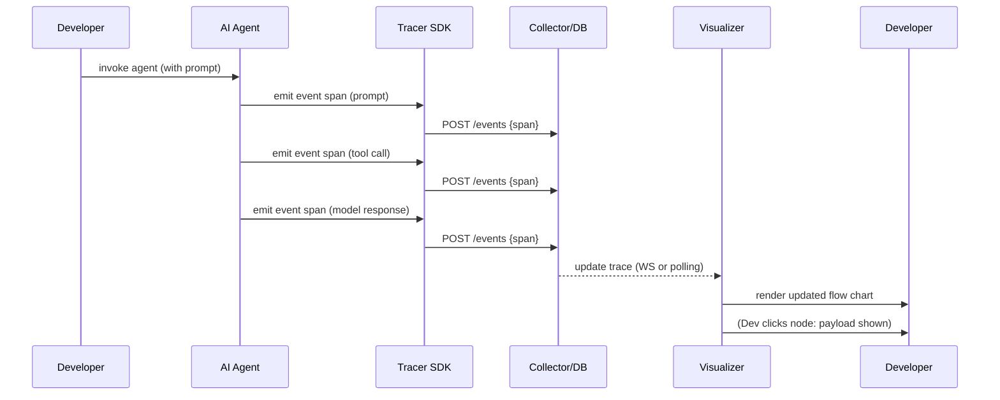
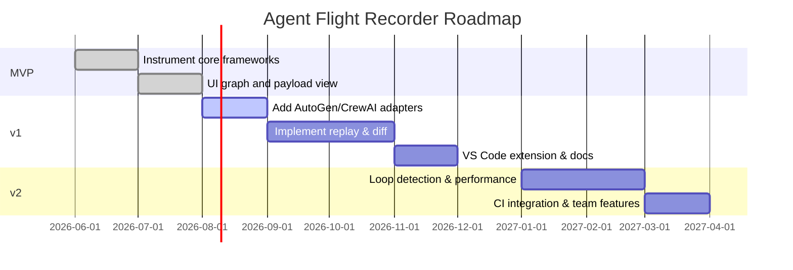
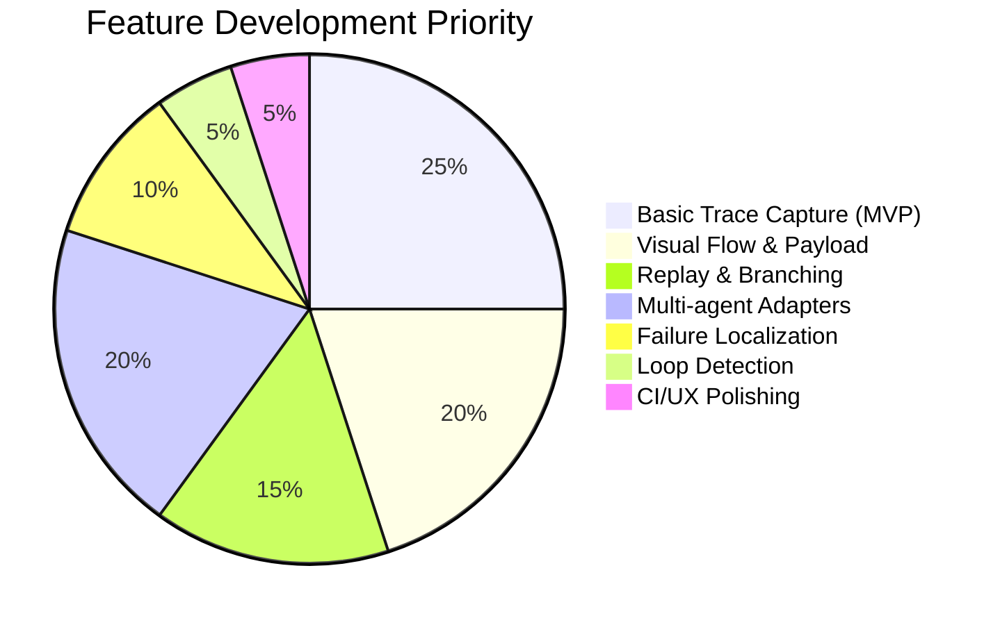

# Executive Summary  
AI agent frameworks (CrewAI, LangChain, AutoGen, etc.) enable powerful multi-step workflows, but they lack visibility into **why** agents behave as they do. Users and developers suffer from mysterious failures, hidden token limits, and coordination breakdowns【1†L168-L172】【7†L100-L104】. This project proposes an **“Agent Flight Recorder”** – a unified observability/debugging tool for multi-agent AI. It captures every prompt, response, tool call, and agent handoff as a structured trace, visualized as a flow diagram with payload inspection. Developers can click any node to view details, replay execution branches, diff outcomes, and detect loops or failed steps【35†L24-L33】【35†L106-L114】. Unlike generic APMs, it’s built for AI workflows: full-context, token-level traces, with human-in-the-loop checkpoints and side-effect tracking【35†L24-L33】【35†L35-L43】.  

With integrations (LangChain, AutoGen, CrewAI, LangGraph, etc.), this open-source tool will plug into existing stacks via adapters (e.g. callbacks or OpenTelemetry hooks) to emit a common JSON trace. A web or VS Code UI then displays the conversation timeline, highlights failures, and allows replay/forking for in-depth debugging【35†L24-L33】【1†L225-L230】. This addresses a **persistent pain**: opaque AI behavior. By providing “explainability in action” (cf. Honeycomb’s “Agent Timeline”【1†L168-L172】【1†L225-L230】 or Tracewire’s DAG view【35†L24-L33】), the tool helps teams diagnose issues in minutes instead of hours. 

Key features include: **visual flow graph**, **node payload inspector**, **replay/forking**, **trace diffing**, **loop detection**, **context propagation tracking**, and **failure localization**. Each connects to the others – e.g. flow visualization is the canvas for clicking nodes (payload inspection) and replay, while diffing highlights changes between branches, revealing the root cause of errors. Context tracking ensures we follow the exact data passed between agents.  

We recommend a mixed stack: a **TypeScript/Node** codebase (React) for the UI/extension, and Python libraries for agent instrumentation. Frontend technologies (D3.js/React Flow/Mermaid) render the flows, while OpenTelemetry/Jaeger handle back-end tracing and storage (SQL/NoSQL). See the **Tech Stack** section for tradeoffs. The MVP will deliver a working prototype: LangChain + AutoGen hooks sending traces to a local web app that visualizes a simple multi-step chain.  

A phased roadmap (MVP → v1 → v2) spells out iterations: from basic event capture and flow UI to full multi-agent support, diff/replay, metrics, and CI integration. Success is measured by integrated demos, user feedback (time saved debugging), and adoption (stars, forks) of the open repo. We’ll license permissively (MIT/Apache) and publish clear contributor guidelines to foster community collaboration.

# Problem Statement  
Modern multi-agent AI apps are **opaque**. Each agent call, tool invocation, or external API hit is a “fragment” scattered across logs or APMs, with no single view of the conversation【1†L168-L172】. When agents fail (loop endlessly, hit token limits, or crash), engineers spend hours gluing bits of information together. They often **don’t know which agent or tool call caused a problem**, or why context was lost【7†L100-L104】. For example, an enterprise agent might halt mid-task and the on-call engineer must juggle LLM metrics, network logs, and memory banks to guess what happened【1†L168-L172】.  

This opacity is a **persistent pain**: non-technical stakeholders (e.g. product owners) also find it mysterious and untrustworthy. They may wonder, *“Why did our refund bot stop? Did it hallucinate the order ID?”* without an easy answer. Meanwhile, token usage and costs are hidden across systems, leading to surprises. In short, there is a **knowledge gap** and **invisibility problem** in agent workflows【1†L168-L172】【7†L100-L104】.

# Target Users  
- **AI Developers & MLOps Engineers**: People building agents with LangChain, AutoGen, CrewAI, etc., who need to debug and optimize multi-agent flows. They want to see *“the whole conversation”* end-to-end and find errors quickly【1†L168-L172】【35†L24-L33】.  
- **Non-technical Stakeholders**: Product managers or analysts who want assurance and transparency (“What is the agent doing?”). Visualization and artifact summaries (akin to Google’s Antigravity “artifacts”【36†L89-L97】) make complex logic understandable.  
- **AI Research & Dev Teams**: Teams evaluating new agent architectures or prompting strategies will use it to compare approaches. For example, they can diff two prompt versions to see how behavior changes.  
- **DevOps/MLOps Tools Integrators**: Organizations building pipelines (e.g. CI/CD for agents) can integrate this as a checkpoint or post-mortem tool.

# Core Features  

- **Visual Flow Chart (Conversation DAG)** – Displays the entire agent workflow as a directed graph: nodes are prompts, model calls, tool calls or agents; edges show data flow/context. This *“flight recorder”* view helps users see the sequence of events at a glance【35†L24-L33】. It integrates all activity (prompts, tool invocations, etc.) into one coherent timeline. Without it, teams rely on fragmentary text logs. *How to implement:* Use a graph visualization library (e.g. React Flow or D3) to render spans and edges. Each node can be clicked to inspect details. The UI groups related spans (agents, tools) and highlights the current execution path. (Tracewire already captures a structured DAG【35†L24-L33】, which we can replicate and visualize.)  

- **Node-level Payload Inspection** – Clicking a node in the flow shows the full payload (prompt text, tool input/output, LLM response, tokens, metadata) for that step. This answers *“exactly what was sent/returned?”*. It’s essential because subtle prompt differences often cause failures. Payload inspection ties directly to the visual flow: every node can expand or show a tooltip with raw and parsed data. For example, a JSON bug is obvious if the expected output is malformed. *Why it matters:* Agents fail with invalid JSON or bad tool calls; seeing the exact inputs helps localize the bug. This feature builds on the full-payload tracing (as Tracewire does【35†L24-L33】). Implementation: the instrumentation should capture and store the payload; the UI displays it (with syntax highlighting).  

- **Replay & Forking** – From any point in the trace, the user can “fork” and re-run the agent from that event with modified inputs. For example, if an agent retried a failing API call, one can remove the retry or use a mock response. This reproduces an effect known in distributed tracing: *“go back in time and alter an event”*【35†L29-L33】. Why: real AI debugging often means tweaking and re-running prompts. Forking also supports **A/B testing** within a session (branch 1 vs branch 2) and human-in-the-loop approvals【35†L29-L33】. *Implementation:* The trace data becomes a record that can be re-issued to the agent framework. We’ll implement a mini replay server: clicking “replay from here” sends the trace context and any user edits back to the instrumentation, which runs the agent code again (possibly sandboxed) and streams the new trace side-by-side. Existing work like Tracewire explicitly provides this (with warnings on irreversible actions)【35†L29-L33】.  

- **Trace Diffing (Branch Comparison)** – When users replay and fork, the tool can automatically diff the original vs. new trace. This highlights where results diverged. For example, if changing a prompt led to a different plan, the diffing overlay shows the branch point and changed nodes. *Why:* Quickly identifying differences (e.g. in token usage, model answers, or tool paths) is crucial for diagnosing why a fix worked. A diff view might show mismatched text or new error nodes. *Implementation:* During replay, collect both execution trees, then visually align and color-code differences (similar to Git diffs or AST diffs). This connects directly to forking: each replay is a new branch for diff.  

- **Loop Detection** – Recognizes when agents get stuck in repeating patterns. Multi-agent workflows can accidentally loop (Agent A calls B calls A, or an agent retries infinitely). We’ll detect loops by analyzing the trace graph for cycles or repeated sequences. *Why:* Infinite or excessive loops waste tokens and break workflows. Detecting them (and alerting, or automatically breaking loops) helps reliability. AgentOps already flags recursive loops【10†L948-L952】, confirming the pain. *Implementation:* After tracing, run a graph algorithm to find cycles. On the UI, highlight loops (e.g. repeated nodes) and show a warning.  

- **Context Propagation Tracking** – Ensures the trace records how data/context flows between agents and calls. For example, if agent A generates a piece of text that becomes agent B’s prompt, the link should be explicit. This is partly satisfied by the DAG edges, but context tracking emphasizes inherited memory or topic shifts. *Why:* Agents may carry conversation memory or state; knowing that “this piece of text came from earlier Agent C’s response” is vital. Implementation involves tagging events with context metadata (conversation ID, memory keys) and displaying that lineage in tooltips. The full trace makes this visible.  

- **Failure Localization** – Automatically identifies the “red line” where the workflow broke. For instance, if a tool returned an error or if an agent threw an exception, that node/edge is highlighted (e.g. in red) in the flow. Users can then drill into the error message. *Why:* Pinpointing which step failed (and seeing preceding events) dramatically shortens debugging time. For example, Honeycomb’s demo shows *“failing tool invocation lights up”*【1†L225-L230】 and you click it for details. Implementation: instrumentation should catch exceptions or error codes and mark spans with status. The UI then flags them.   By combining with timeline/flow, developers see the failure in full context: e.g. an API 502 from downstream linked to a particular LLM call【1†L225-L230】.

These features interlock: the visual flow is the canvas for payload viewing and failure highlighting; diffing relies on replay; loop detection is applied on the captured flow. Together, they give **complete visibility** into agent reasoning, turning “black box” runs into inspectable stories【1†L168-L172】【35†L24-L33】.

# Integration Points  

We will build adapters/hooks for major agent frameworks and platforms so the recorder works out-of-the-box:

- **LangChain (Python/JS)** – Use LangChain callbacks or middleware to capture chains, chains of chains, and tools. Tracewire’s `TracewireCallbackHandler` and LangSmith’s tracing (via env vars) demonstrate this【35†L89-L98】【29†L175-L183】. We can implement a LangChain callback that logs each step (prompt, model, tool) to our trace schema. (For LangChain.js, similarly use a JS callback.)  

- **LangGraph (LangChain’s DAG framework)** – Instrument LangGraph nodes and edges similarly via a global callback or context manager (LangSmith’s docs show this works with LangChain/Graph【29†L175-L183】). Our adapter will listen to GraphFlow or Workflow executors to capture sub-tasks as spans.  

- **AutoGen (Microsoft)** – AutoGen has built-in OpenTelemetry support【26†L89-L97】. We’ll hook into its OTel exporter: for Python, set up an OTLP exporter to our service (Jaeger or custom). This automatically captures agent chats and tool calls. If needed, wrap the AutoGen `Agent` objects with a custom tracer (like `OpenTelemetryInstrumentor()`) as shown in their docs【26†L89-L97】.  

- **CrewAI (crewAIInc)** – CrewAI’s open-source orchestration can emit hooks. Tracewire provides a `TracewireCrewCallback` for CrewAI【35†L106-L114】. We can similarly wrap the Crew runtime to log task delegations and tool outputs. If CrewAI exposes events or callbacks (the docs hint at YAML and code-based “define crew” APIs【27†L153-L163】), we insert logging there. The goal is to capture *“task delegation, agent reasoning, and tool execution across the crew workflow”*【35†L106-L114】.  

- **Claude Code / Sonnet IDE** – Anthropic’s agentic IDE (Claude Code) is new; it likely provides programmatic hooks or an API. At minimum, we can monitor the usage of Claude models via their open APIs to count tokens or intercept prompts. If official plugin support exists, we’d use it. Otherwise, treat Claude Code sessions like any LLM call with our tracer.  

- **Antigravity IDE (Google)** – While Antigravity is mainly an IDE/interface, it does spawn agents. Since it’s a VSCode-based platform【36†L39-L47】【36†L89-L97】, we can develop a VS Code extension for it or communicate via its extension API to capture generated artifacts. For now, we note that agents produce **Artifacts** (task lists, screenshots) instead of raw logs【36†L89-L97】. Our approach would be to fetch these artifacts (if exposed via APIs) and include them in the trace. We’ll also track any “spawned agents” via Antigravity’s manager surface【36†L53-L61】.  

- **VS Code (Copilot, CLI)** – A custom VS Code extension can intercept Copilot outputs or console logs (if available) using VS Code’s `DebugAdapter` or output channels. For example, the AI Toolkit for VSCode provides infrastructure. We can add a panel that subscribes to a local trace (like a web app) and updates live. For GitHub Copilot CLI, it could log locally, which our extension reads.  

- **GitHub Actions / CI** – In a CI setting, we’ll offer a CLI tool or action. Developers can use our CLI to instrument and run their agent tests. The CLI will emit a trace JSON file. A GitHub Action can then upload this to a hosted UI, or comment a link. We’ll provide a `gha` config sample that uses an API to fetch the trace into a PR comment or web UI.  

**Adapter Pattern & Hooks:** We plan a **modular adapter** system. Each framework adapter converts its native events into our **common JSON schema** (shown below). For example, a LangChain callback emits:  
```json
{"id":"span1","timestamp":1680000000,"agent":"PlannerAgent","type":"prompt","content":"Plan a trip","parent":null,"tokens":125}
```  
A LangChain `trace_id` or Parent ID links spans. AutoGen’s OTel spans are mapped to the same schema fields. Framework-specific adapters (LangChain, AutoGen, CrewAI) share a base class to serialize spans. We’ll define a JSON schema with fields like: `id, parent_id, timestamp, agent_id, action_type, payload, cost, success_flag` etc. (See **Event Schema Example**). 

**Event Schema (JSON):** Each event (span) will look like: 

```json
{
  "span_id": "UUID", 
  "parent_span": "UUID or null", 
  "timestamp": 1680012345, 
  "agent": "QA-Agent", 
  "type": "model_call", 
  "model": "gpt-4", 
  "prompt": "Answer X", 
  "response": "Y", 
  "tokens_used": 150, 
  "tool": null,
  "error": null
}
```

For a tool call, fields `tool`, `tool_input`, `tool_output`, `error_code` would be set. This unified format ensures traceability across any adapter.

# Supported Runtimes  

- **Browser Extension:** A Chrome/Edge extension can observe web-based agents (e.g. Claude, or the web UIs of CrewAI/Tracewire) by injecting scripts. It could also serve as a data collector UI panel, displaying traces for agents running in-page. Example: an extension could detect OpenAI API calls on a page and log events.  

- **VS Code Extension:** A VS Code extension will provide a sidebar/panel that connects to the trace server. It can both display the visual debugger and intercept local LLM calls (via Copilot or local agent run). The Antigravity interface (built on VSCode) might also host our panel. VSCode’s webview API and Authentication can link to our trace data.  

- **Standalone SDK/Library:** A core SDK in Python (and TypeScript) will instrument agent code. Teams can import `agentflightrecorder` and wrap their agent initializations. This SDK collects spans and can optionally serve a mini HTTP endpoint to publish them.  

- **Server Agent Collector:** A background service (Node or Python) that aggregates traces from multiple sources. Agents (browser or VSCode) push events via WebSockets or HTTP to this server. The server stores them (e.g. in SQLite or a time-series DB) and feeds the UI. This collector can run locally (for dev) or centrally (for shared environments).  

By supporting multiple runtimes, we meet developers **where they work**. A user can install the VS Code extension, drop in our Python SDK for their agents, and optionally add a browser extension for monitoring cloud-hosted AI tools.

# Implementation Approach  

Each feature ties to others:

- **Flow + Payload:** We’ll serialize traced events into a JSON graph. On the frontend, libraries like React Flow (React) or visx/D3 will draw the graph. Nodes will be interactive: clicking a node opens a detail pane with the payload (text, JSON, tokens). This UI has two panes: *graph view* and *inspector view*. Building on ideas from Tracewire【35†L24-L33】, each trace is a DAG of steps (LLM calls, tool calls, decision points). The graph is the “spine”; payload details are loaded on demand.  

- **Replay/Forking + Diffing:** We’ll implement a replay engine: when the user “forks” from node X, the SDK re-executes the agent from that context. This yields a second trace. The frontend then highlights differences: e.g., align the two graphs side-by-side or overlay, highlighting nodes where text or flows diverge. Diffing uses string diff for prompt/response changes, and graph diff algorithms for structural changes. This integrated flow (figure→fork→diff) is analogous to Git branching.  

- **Loop Detection + Context Tracking:** The backend will post-process traces to detect loops (graph cycles) and annotate context lineage. For example, if Node 7’s payload equals Node 3’s payload, flag a loop. The UI can then mark these nodes or auto-stop loops. Context tracking ensures agents passing conversational memory appear in the trace – either as edges or tags.  

- **Failure Localization:** Any span marked with an error or high latency will automatically jump out (e.g. with a “!” icon on the graph). The graph’s legend can filter “failures only” as Honeycomb demonstrated【1†L225-L230】. The UI will let users jump to the error span, view its stderr or API error, then scroll up to see “what just happened before this”.

Each component is loosely coupled via the trace JSON. The flow graph is rebuilt any time new spans are added. All features rely on **rich instrumentation**: we will likely use or adapt OpenTelemetry for core tracing (like AutoGen’s approach【26†L89-L97】) combined with lightweight event capture for simpler frameworks. The tech stack section outlines libraries to use.

# Roadmap (Phased Development)  

| Phase | Deliverables | Acceptance Criteria | Success Metrics |
|---|---|---|---|
| **MVP** (1–2 mo) | - Trace SDK (Python, TS) capturing prompts/responses for LangChain agents<br>- Local web UI showing basic flow graph (nodes = LLM/tool calls) with payload view<br>- Integration with one framework (e.g. LangChain) via callback<br>- Simple JSON schema and storage (SQLite) | - Can instrument a sample LangChain agent end-to-end<br>- UI displays the conversation graph correctly<br>- Nodes clickable showing prompt/answer<br>- No major bugs; minimal latency | - Completed demo of a multi-step chain with trace<br>- Positive feedback from one pilot user<br>- Repository initiated, >0 stargazers (OSS traction) |
| **v1** (3–4 mo) | - Add AutoGen & CrewAI adapters (demonstrated end-to-end)<br>- Implement replay/fork feature for single-agent flows<br>- Failure highlighting (errors/latency) in UI<br>- Diffing UI between two branches<br>- Integrate OpenTelemetry/Jaeger backend for scalable tracing<br>- Provide VS Code extension (panel showing the UI)<br>- Documentation & contributor guide | - Successful trace of an AutoGen/crewAI example with replay<br>- UI marks failures and can replay a branch<br>- VS Code extension loads the local trace for debugging<br>- Roadmap and code documented; pass basic lints/tests | - Additional pilot(s) using the new features<br>- GitHub stars/forks reach initial goal (e.g., 50+)<br>- Speedup: average debug time <50% baseline (measured in user tests) |
| **v2** (6–9 mo) | - Support LangSmith/Claude/Antigravity workflows (demo or partial)<br>- Loop detection warnings and automatic break suggestions<br>- Sequence diagrams or timelines export (Mermaid/PDF) for reports<br>- CLI tool and GitHub Action integration (trace collection in CI)<br>- Collaboration features (annotate traces, share links)<br>- Optimize performance (large traces, thousands of spans) | - Demonstrated integration with at least 3 frameworks<br>- CI pipeline successfully publishes a trace report<br>- Complex test workload (1000 spans) remains responsive<br>- Contributors outside core team make accepted PRs (community growth) | - Broader adoption (100+ stars, forks, pub talk/blog)<br>- Documented use in at least one project or tutorial<br>- Downloads or instals metrics (if any) grow steadily |

Each phase will have detailed user stories and tests. **MVP** focuses on fundamentals: capturing events and showing a graph. **v1** fleshes out core features (replay, diff, failure). **v2** targets polish, broader integration, and community. Acceptance is demo-based: we should be able to demo a trace in about 5 minutes.

# Tech Stack & Implementation Choices  

- **Language:** *Node.js/TypeScript* is recommended for the UI, extensions, and server. It’s ideal for web apps (React) and VS Code extensions. For agent-side libraries, we’ll also provide *Python* packages (since LangChain/AutoGen are Python). The tradeoff: Python is native for many agents, but Node allows easier integration of frontend and packaging (and supports TypeScript for shared types). A hybrid approach is best: e.g. trace emitter in Python (via pip), and a Node “collector” service. For fairness, we could also build a Node (JS) instrumentation for LangChain.js and Vercel SDK.  

- **Frontend (Visualization):** Use React. For the graph/flow: **React Flow** (MIT) or **VisX** by Airbnb are strong candidates. *React Flow* excels at node-based editors (drag/drop, zoom, nice interactivity); *VisX* leverages D3 under the hood with React. We should prototype with both. For static charts (timelines, pie charts), **Mermaid** (MIT) is easy (textual diagrams) or **Chart.js/Plotly** for interactive stats. Table below compares:  

  | Library         | Browser Support | Performance        | Interactivity         | Learning Curve       | License   |
  |-----------------|-----------------|--------------------|-----------------------|----------------------|-----------|
  | **D3.js**       | Yes (native)    | Very High (custom) | Very High (custom)    | Steep (low-level)    | BSD/ISC   |
  | **React Flow**  | Yes (React)     | High (optimized)   | High (drag, zoom)     | Moderate (React API) | MIT       |
  | **VisX**        | Yes (React)     | High (scalable)    | High (user interactions) | Moderate (SVG/D3) | MIT       |
  | **Mermaid**     | Yes (HTML SVG)  | Good (simple diagrams) | Limited (static after render) | Low (markdown-like) | MIT       |
  | **Chart.js**    | Yes (canvas)    | Good               | Moderate (hover)      | Low (config-driven)  | MIT       |
  | **OpenTelemetry** | *Not applicable (instrumentation library)* | N/A | N/A               | High (concepts)    | Apache 2.0 |
  | **Jaeger UI**   | Yes (JS web UI) | Good (suitable for 1000s spans) | Moderate       | Medium (setup)        | Apache 2.0 |
  | **Zipkin UI**   | Yes             | Good               | Moderate             | Low (simpler setup)   | Apache 2.0 |

- **Backend / Storage:** For MVP, a simple embedded **SQLite** (with [better-sqlite3](https://github.com/WiseLibs/better-sqlite3)) can store trace events. It’s easy to bundle and query in real-time (via SQL). For larger scale, **Postgres** or **ClickHouse** (as Trace-lit suggests【19†L48-L54】) can be used. We may also consider a time-series DB (TimescaleDB) for token/latency metrics. Traces can be stored as relational (spans table, relations) or as JSON in SQLite. For indexing and search (e.g. filter by agent, token count), a small index on key fields is enough. If near-realtime not needed, a log file or vector DB could also archive sessions, but SQL is simplest.  

- **Tracing & Instrumentation:** We will leverage **OpenTelemetry** (OTel) for the heavy lifting. Many frameworks (AutoGen) already use OTel【26†L89-L97】. We can create an OTel **Collector** service (or use Jaeger/Zipkin) to ingest spans. Libraries: use `@opentelemetry/sdk` (JS) and `opentelemetry-sdk` (Python). For direct solution, **Jaeger** (Apache) is a great UI+backend for distributed traces. Another choice is **Zipkin** (simpler). Since all are Apache-licensed, either works. Jaeger has a richer UI (trees, flamegraphs).  

- **Visualization Libs:** Besides graph libs, **Mermaid** (for quick Gantt/timeline and pie charts) can be embedded in markdown in the UI. This satisfies “example charts” easily. We’ll also use standard UI components (Material-UI or Ant Design) for panels, tables, etc.  

- **Instrumentation Hooks:** For each framework, we’ll either use existing tracing or inject middleware: e.g. LangChain’s callback API, OpenAI instrumentation, etc. We’ll create *adapter classes* that conform to OTel if possible. For example, use `opentelemetry-instrumentation-openai` (Python) to auto-capture model calls (as in AutoGen docs).  

- **Auth & Packaging:** The VS Code extension and web app may require user accounts or workspace keys for multi-tenant use. We can start without auth for MVP (local use only). Licensing: likely **MIT or Apache 2.0** to maximize adoption. Contributor guidelines: simple CONTRIBUTING.md with issue/pull request process, code style rules, code of conduct (like Contributor Covenant).  

- **VS Code/Extension Tech:** Build the VS Code UI panel using web technologies (React), pack it with `vsce`. The CLI tool and Node server use TypeScript. Python SDK distribution via PyPI.  

Given the need to work with AI libraries (mostly Python), splitting the stack is acceptable. Key is having clear interfaces (JSON events over WebSockets/HTTP). The UI doesn’t need Python knowledge, and the instrumentation library abstracts it away. 

# Existing Open-Source Solutions & Reuse  

We will reuse and integrate with these prominent projects where feasible:  

- **Tracewire (OSS, Apache 2.0)**【35†L179-L182】 – *Key reusable insights:* It captures full DAGs of LLM calls with payloads【35†L24-L33】, supports LangChain, AutoGen, CrewAI via built-in adapters【35†L106-L114】, and offers replay/forking. We can study Tracewire’s adapters (on GitHub) for patterns and potentially reuse code (it’s MIT/Apache). Its web UI (React) could inspire our graph rendering.  

- **AgentOps (Python SDK)**【10†L869-L878】【10†L948-L957】 – Offers integration with many frameworks (CrewAI, Autogen, AG2, etc.) and tracks costs, retries, loops【10†L948-L957】. The open-source GitHub repo may contain examples of hooking into agents; e.g. it lists Camel, crewAI, llama-index. We’ll examine their SDK for example schemas. Note: it’s a commercial service too, but code is available MIT/Apache.  

- **Pydantic AI / Logfire (Python/JS, MIT)** – Provides a generic observability stack for LLMs built on OpenTelemetry【28†L366-L370】【28†L498-L501】. We can reuse their OTel-based SDK for lower-level instrumentation, since it already supports LangChain, LlamaIndex, etc. Their SQL querying approach (Postgres) and UI demos might inform our own. They also have an MCP (Model Context Protocol) server which we might incorporate as an option for trace storage.  

- **LangSmith (LangChain, SaaS)** – While closed-source, its docs show how trivial it is to integrate via env vars【29†L175-L183】. We can replicate the approach for LangChain: no code change needed if a simple tracer env var is recognized. (If someone is already using LangSmith, we might simply import their data, but mainly we just mimic its behavior.)  

- **Trace-lit (OSS)** – A new open-source “observability for multi-agent AI”【19†L48-L54】. It uses a Python decorator to send spans to Kafka→ClickHouse/Timescale【19†L48-L54】. Even if we don’t use Kafka/ClickHouse, its idea of a single decorator is neat. We may look at their GitHub (trace-lit.com) for implementation details or early code.  

- **AI Gateway / TrueFoundry (TrueFoundry)** – TrueFoundry’s Traceloop (their telemetry) and blog discuss grouping events into unified traces【5†L37-L46】. We’ll draw on their pillar concept (traces, tool calls, failures) for our feature list.  

- **Langfuse (closed)** – Similar concept to LangSmith. The MLflow comparisons show how Langfuse and MLflow autolog work【29†L182-L190】. If needed, we might integrate with MLflow as an optional backend since MLflow is open-source and can log agent traces.  

- **OpenTelemetry / Jaeger / Zipkin** – Not apps but essential libs. OTel SDKs will be used in instrumentation. Jaeger/Zipkin servers (or an OTel collector) will be reused for storing and visualizing raw traces.  

- **Visualization libraries:** Reuse React Flow (MIT), VisX (MIT), etc., as noted. For diagrams, Mermaid (MIT) is open-source and can be embedded in docs.  

- **Local Inference (Optional):** If we want on-device text analysis (e.g. summarizing long prompts), **transformers.js** (MIT, runs in-browser) could help annotate flows (e.g. highlight the most important text). This is a bonus – not core to tracing, but could reduce reliance on cloud LLMs.  

Where possible, we’ll integrate existing code. For example, we might call Pydantic’s Logfire SDK to do OTel emission, and use its open SQL schema. We will also reference open repos in documentation. A lot of code will be new (especially the UI and diff engine), but studying these projects will accelerate development and ensure we aren’t reinventing solutions.

# Integration Design & Event Schema  

We will define concrete **adapter patterns**:  

- *LangChain Adapter:* A LangChain Callback that listens to `on_chain_start`, `on_llm_new_token`, `on_tool_start`, etc., and emits spans.  
- *AutoGen Adapter:* Hook into AutoGen’s runtime via OpenTelemetry; possibly subclass `AgentTeam` to add an OTLP exporter.  
- *CrewAI Adapter:* Insert a middleware into Crew workflows. (E.g. wrap Crew’s task execution loop.)  
- *Generic LLM Hook:* For any raw OpenAI/Gemini call, wrap the client with an OpenTelemetry tracer or with our own `wrapLanguageModel` (as Tracewire suggests【35†L100-L108】).  

**Sample JSON event schema:**  
```json
{
  "span_id": "abcd-1234",
  "parent_span": "parent-uuid-or-null",
  "timestamp": 1680012345678,
  "agent_name": "ForecastAgent",
  "step_type": "model_call",       
  "model_name": "gpt-5.4",        
  "prompt": "What will the weather be tomorrow in London?",   
  "response": "Sunny",           
  "tokens_in": 15,               
  "tokens_out": 10,              
  "tool": null,                  
  "tool_args": null,             
  "tool_result": null,           
  "memory_key": "location",      
  "memory_value": "London",      
  "error": null,                 
  "success": true                
}
```
- `span_id`/`parent_span`: link events.
- `agent_name`: which agent or crew did this.
- `step_type`: e.g. `"prompt"`, `"model_call"`, `"tool_call"`, `"decision"`.
- `prompt`/`response`: text or data.
- `model_name`: LLM used.
- `tool`, `tool_args`, `tool_result`: details if it invoked a tool.
- `memory_...`: any RAG or memory references.
- `error`/`success`: for failures.  

All adapters will output in this schema, possibly as JSON objects over a WebSocket or HTTP POST to the collector. The collector will batch these into the DB. The schema will be documented for contributors.

# Developer UX & Extensions  

We envision a seamless experience:

- **VS Code Panel:** A custom sidebar in VS Code (or an Antigravity panel) that loads the Visual Debugger. As the agent runs (locally or via API), the trace updates live or on request. The user can browse the flow, click nodes, and even resume/continue the agent from VSCode. VS Code can also display diff views side-by-side in editors.  

- **Web App Dashboard:** A React web app (served by our Node/Express or Flask server) that shows saved traces. Users can upload trace JSON or connect to a local collector. The dashboard has project/workspace organization (like “reports”). It will be mobile-friendly to some extent for quick checks.  

- **Command-Line Interface:** A small CLI (Python or Node) to instrument and run agents. E.g. `afrecord run my_agent_config.yaml --trace=trace.json`. This makes it scriptable. It can also start a local server for real-time UI. For CI integration, this CLI can export traces and stats.  

- **Browser Extension:** For web-based agents or public APIs (like ChatGPT or Claude on the web), an extension could intercept requests (if CORS allows) or use content scripts to scrape chat UIs, sending data to our collector. For example, hooking an internal JS API of a chat app to capture prompts/responses.  

- **Initial Launch Channel:** We recommend launching as a **VS Code extension plus GitHub repo + Web demo**. Many developers discover tools via VS Code marketplace or GitHub. We could also demo via YouTube or article on relevant forums. Having a working VS Code plugin that “just works” with your existing agent code will get early traction.

# Licencing & Contribution Guidelines  

We suggest an **MIT or Apache 2.0** license (both are permissive; Apache adds patent grant). Given others use Apache (OTel, Tracewire) and we may incorporate code under Apache, Apache 2.0 could be safest. Contributor guidelines will follow common open-source norms: a `CONTRIBUTING.md`, a clear roadmap in the README, and a code of conduct (e.g. the Contributor Covenant). The repo should encourage pull requests for adapters and UI enhancements, and use semantic versioning.

# Integration Adapter Patterns  

For each integration we define:  

- **Adapter Class:** E.g. `class LangChainTracer` with methods `on_start`, `on_new_token`, etc. All adapters implement an interface `trace_event(event_dict)`.  

- **Hooking In:** Use dependency injection or wrapper functions. For example, wrap the `Chain.run` call inside a trace context. Or monkey-patch the ChatOpenAI client with an OTel instrumentor.  

- **Event Emission:** The adapter builds an event JSON (as above) and sends it to a central queue or directly via HTTP to the collector’s ingest endpoint (e.g. `POST /api/events`). Alternatively, it can push to an in-memory list if running in-process.  

- **Context IDs:** Each agent session gets a unique trace ID. Events include this `trace_id` so the server groups them. The UI filters by trace.  

# Example Event JSON (Span)  

```json
{
  "span_id": "span-42",
  "parent_span": "span-17",
  "timestamp": 1680056789012,
  "trace_id": "trace-abc123",
  "agent_name": "MainAgent",
  "step_type": "tool_call",
  "tool": "PostgreSQLQuery",
  "tool_args": {"sql": "SELECT count(*) FROM orders;"},
  "tool_result": {"rows": [[5]]},
  "tokens_in": 0,
  "tokens_out": 0,
  "error": null,
  "success": true
}
```

Multiple such JSON objects form the trace for one conversation.

# Tech Stack Recommendation  

- **Frontend:** React + TypeScript, bundled with Vite or Webpack. Use React Flow (https://reactflow.dev) for the interactive graph; D3/VisX for custom charts. For CSS/UI, we might use Chakra UI or Material-UI.  

- **Backend:** Node.js/TypeScript (Express or Fastify) to serve the web app and collect events. Alternatively, Python (FastAPI) could be used if more comfortable. Node has advantage for VS Code and NPM packaging.  

- **Database:** SQLite for MVP (via better-sqlite3 or knex), scalable to Postgres/Timescale. Use Prisma or TypeORM for ease (Node) or SQLAlchemy (Python).  

- **Tracing:** OpenTelemetry SDK (JS + Python). Jaeger all-in-one (OTLP) for initial backend; later option to run a Collector + Jaeger.  

- **VSCode Extension:** Use the VSCode Extension API (TypeScript). The extension’s webview will load the same React app, communicating via message passing to control it.  

- **Browser Extension:** Standard WebExtension manifest v3, with content scripts.  

- **Authentication:** In MVP, none. Later, consider token-based API keys for multi-tenant (team workspaces). Use JSON Web Tokens or OAuth if remote access needed.  

**Language Choice (Node vs Python):** Node/TS is recommended for the core UI and extension. Python is recommended for any instrumentation layer (due to LangChain/AutoGen). The tradeoff: writing two languages. It is acceptable – we’ll keep interfaces simple. The UI workflow benefits from Node’s rich ecosystem (npm, React), while Python instrumentation can be dropped into existing Python agent codebases.  

# Libraries and Tools Comparison  

We already summarized key candidates above. Additional notes:  
- **Flowchart/Graph:** React Flow (MIT, dynamic, great docs), or VisX (more custom code). D3 is powerful but low-level.  
- **Gantt/Timeline Charts:** mermaid’s timeline or Plotly timeline could illustrate project phases.  
- **Pie/Bar Charts:** Chart.js or Recharts (MIT) for simple stats. Mermaid supports pie in markdown.  

Tracers:  
- **OpenTelemetry (Apache 2.0)** – Multi-language instrumentation (Python/Node/.NET). It’s the standard.  
- **Jaeger (Apache 2.0)** – UI+backend for OTel traces. Good for traces on Docker.  
- **Zipkin (Apache 2.0)** – Simpler tracing store; might suffice for initial metrics.  
- **Logstash/Elastic** – Overkill for now.  

The chosen stack (OTel + Jaeger + SQLite + Node/React) is all open-source with liberal licenses, ensuring reusability and avoid vendor lock-in.

# System Architecture (Mermaid)  

```mermaid
flowchart LR
  subgraph AgentEnvironment
    Code["User's Agent Code\n(LangChain/CrewAI/etc)"]
    Instrument["Tracing Adapter/SDK"]
    Code --> Instrument --> Collector
  end

  subgraph AgentFlightServer
    Collector["Event Collector Server\n(HTTP/Websocket)"]
    Store["Trace Storage\n(SQLite/Postgres)"]
    Collector --> Store
  end

  subgraph UserInterface
    Browser["Browser/Web UI"]
    VSCode["VS Code Extension"]
    Browser --> Collector
    VSCode --> Collector
    Browser --> Store
    VSCode --> Store
  end

  NoteOver(Instrument,Store) the flow: Instrument captures events→Collector→Store→UI.
```

This diagram shows agent code (left) emitting events through an adapter, a central collector storing them, and user-facing clients (browser or VSCode) querying the stored traces for visualization.

# Sequence Flow Example (Mermaid)  



This sequence shows a developer’s agent emitting spans that the server collects and the UI rendering live.

# Example Charts  

**Project Roadmap (Timeline)**  


**Feature Priority (Pie Chart)**  


# Next Steps / Tasks  

1. **Set Up Codebase:** Initialize a mono-repo (e.g. with Nx or Lerna) containing subprojects: `sdk-python`, `sdk-node`, `server`, `web-ui`, `vscode-ext`. Configure linting, testing frameworks, and CI.  
2. **Define Event Schema:** Finalize the JSON schema for trace spans. Create TypeScript and Python types/interfaces accordingly. Document it in README.  
3. **LangChain Adapter Prototype:** Build a LangChain callback that logs spans to stdout or a local collector. Test on a simple chain and verify correct JSON output.  
4. **Basic Web UI:** Scaffold a React app. Integrate React Flow or D3. Create a mock JSON trace and render it as a graph. Ensure nodes clickable showing dummy payload.  
5. **Collector Service:** Develop a minimal HTTP/WebSocket server to ingest span JSON (from adapters) and store in SQLite. Expose an API to fetch the trace. Connect the React UI to this API.  
6. **Integration Proof-of-Concept:** Run a simple LangChain script with the adapter sending to the collector and view it in the UI. Debug any serialization issues.  
7. **UI Features:** Add error highlighting (if a span has `"success": false`), and “click to replay” buttons on nodes (initially just triggering a rerun stub).  
8. **AutoGen & CrewAI Adapter:** Implement AutoGen adapter by leveraging OpenTelemetry (configure OTLP exporter to our collector). For CrewAI, identify hook points (tasks execution) and log spans. Verify with sample tasks.  
9. **Replay & Diff Engine:** Implement the replay logic for simple scripts: given a past trace segment, re-run from that point. Store both original and new trace in DB. In UI, develop a diff mode (side-by-side or merged view) highlighting changes.  
10. **Documentation & Licensing:** Write README with overview, installation, quickstart (instrumenting a sample agent). Add CONTRIBUTING.md, LICENSE (e.g. Apache 2.0) and code of conduct. Prepare a tutorial demo for the team.

Completing these tasks will establish the core pipeline of capturing, storing, and visualizing agent traces, enabling us to iterate on features with minimal dependency overhead.

