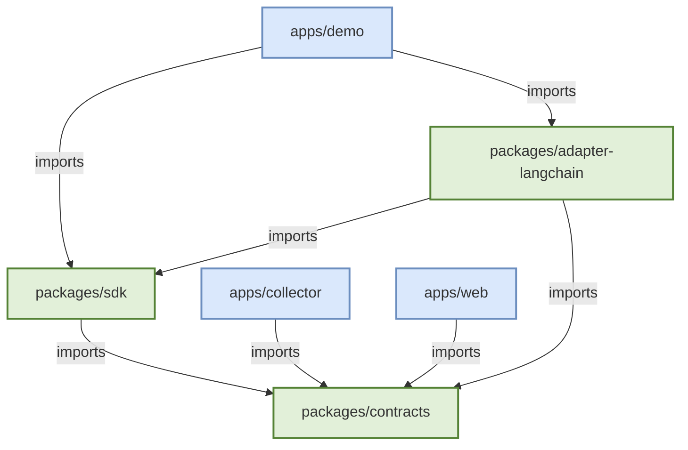

# Package Dependency Graph

To maintain architectural integrity, the repository strictly enforces dependency boundaries between internal packages and apps.

## Allowed Dependency Flow (Phase 1 MVP)

## Boundary Rules (ADR-0001 & ADR-0002)
1. **`contracts` Isolation**: `packages/contracts` has zero internal dependencies. It is the root of the graph.
2. **No App-to-App Coupling**: `apps/web` must not import from `apps/collector`. They only share knowledge via HTTP payloads validated by `packages/contracts`.
3. **Adapters are Stateless**: Adapters like `adapter-langchain` depend only on `sdk` and `contracts`. They never talk directly to SQLite or the UI.
