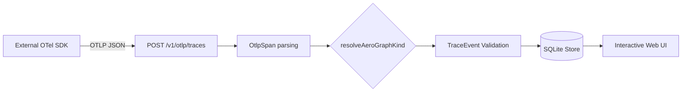

# Collector OTLP Ingestion

The AeroGraph Collector provides a standard, interoperable `POST /v1/otlp/traces` endpoint that accepts OpenTelemetry Protocol (OTLP) HTTP/JSON trace exports.

## Workflow



## Setup & Usage

To ingest external traces, point your OpenTelemetry SDK to the AeroGraph collector's HTTP endpoint. By default, the collector listens on `http://localhost:4317`.

**Python (OpenTelemetry SDK):**
```python
from opentelemetry.exporter.otlp.proto.http.trace_exporter import OTLPSpanExporter
from opentelemetry.sdk.trace.export import BatchSpanProcessor

exporter = OTLPSpanExporter(
    endpoint="http://localhost:4317/v1/otlp/traces"
)
span_processor = BatchSpanProcessor(exporter)
# Attach span_processor to your TracerProvider
```

**TypeScript (OpenTelemetry JS):**
```typescript
import { OTLPTraceExporter } from '@opentelemetry/exporter-trace-otlp-http';
import { BatchSpanProcessor } from '@opentelemetry/sdk-trace-base';

const exporter = new OTLPTraceExporter({
  url: 'http://localhost:4317/v1/otlp/traces',
});
const processor = new BatchSpanProcessor(exporter);
// Attach processor to your NodeTracerProvider
```

## Ingestion Rules

1. **Validation**: All incoming spans are validated against the `OtlpExportRequest` schema.
2. **Translation**: Spans are mapped to canonical `TraceEvent` objects.
   - If `aerograph.kind` is present, mapping is lossless.
   - If not, heuristics are applied to derive the closest AeroGraph event kind (e.g., `gen_ai.chat` -> `response`).
   - Unknown spans fall back to the `note` event kind, keeping all original attributes in their payload.
3. **Append-Only**: All valid `TraceEvent` records are appended to the SQLite store (`store.appendEvent`), respecting replayability guarantees.
4. **Rejection**: If the OTLP payload produces an invalid `TraceEvent`, the request receives a `400 Bad Request` with Zod validation details.

## Troubleshooting

- **400 Bad Request (Invalid OTLP)**: Ensure your SDK uses OTLP over HTTP/JSON (protobuf is not natively supported yet unless routed through an OTel Collector).
- **Missing Spans**: The AeroGraph web UI groups spans by trace ID. Ensure your external spans share the same `traceId` as your AeroGraph events for proper correlation.
